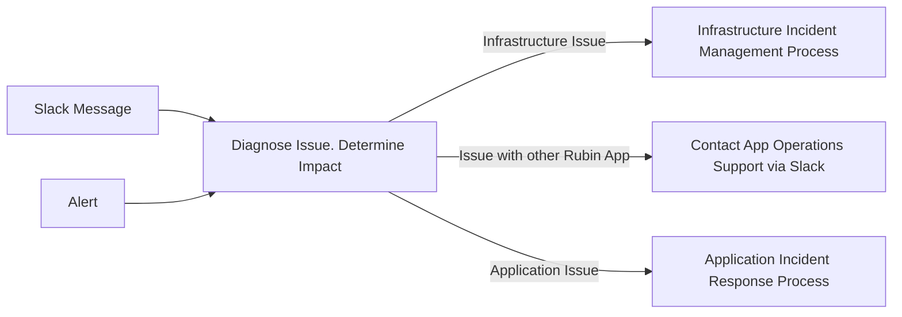
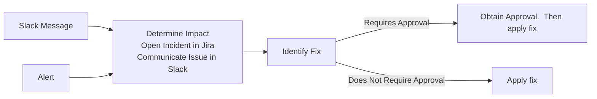
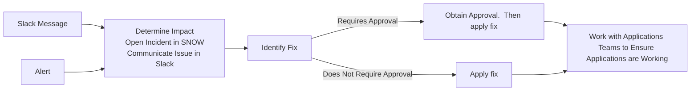

# USDF Rubin Application Operations Support Model

```{abstract}
Rubin depends on a large array of applications, services, and databases.  Collectively these will be referred to as services.  Many of these services are hosted at the United States Data Facility (USDF) run by the SLAC National Accelerator Laboratory.  The USDF is not staffed to to take over all operational responsibilities for all services.  The USDF must rely on service owners/operators for ongoing engagement during operations.  

Rubin and USDF need a standardized and sustainable Concept of Operations (ConOps) framework for developing, deploying, and supporting these services during operations.  The goals of this are to:

* Make the process straightforward for service owner/operators
* Make the support load manageable for the USDF infrastructure team
* Improve ability to respond to issues
* Provide visibility into changes
* Enable better interaction with hardware planning, SLAC Cybersecurity, etc.

This document introduces the ConOps for the Rubin applications at USDF.  This includes the Rubin and USDF roles, Service Management. This document does not detail the overall operations for the US DAC, Long Haul Network, or Summit.
```

## Separation of Responsibilities

Service Owners are responsible for operational state of the the deployed application.  Service Owners will ensure runbooks and documentation is developed.  Operational Support roles will be created in the team to respond to stakeholder queries via Slack and alert USDF/SDF infrastructure staff of issues and needs.

USDF Infrastructure staff is responsible for documenting a standard menu of services.  Currently includes Kubernetes, Storage, DNS, Network, Monitoring, Logging, and Databases.  The USDF will proactively monitoring infrastructure status and investigate issues.  They will respond to infrastructure issues and needs of the Service owners.

There is an overlap of responsibilities with Rubin Science Platform, QServ, Cassandra, and Postgres. The below tables summarizes the shared responsibilities.

| Service | Rubin | USDF | 
| ---- | ----- | ---- |
| Cassandra | | |
| Phalanx/ArgoCD | | |
| Postgres| Implementation and optimization of data model | Installation, upgrades, and monitoring.  Consult on database performance issues.  |
| Rubin Science Platform | |
| Qserv | | |


## Application Support Model

Below are details on the application support model for Rubin applications.  This model is used to define the roles, responsibilities, and priorities for support.

### Application Roles

Each Rubin application should have the following roles defined to manage and operate the application.  A person can have more than one role and may be condensed.  Below are the roles and responsibilities required for each role.

| Role | Responsibilities |
| ---- | ---------------- |
| Application Sponsor | Responsible for assigning resources |
| Application Owner | Responsible for the overall application functionality, data, and user experience |
| Database Administrator | Responsible the database’s design, performance, security, and maintenance.  Not required if there is no database |
| App Infrastructure | Responsible for the infrastructure configuration, deployment, and routine maintenance |
| Operations Support | Responsible for the support of the application.  Handles alerts, application monitoring, application incident response |

### SLAC and Rubin Team Infrastructure Roles

Below are the roles and responsibilities for the SLAC and Rubin Infrastructure teams.

| Role | Responsibilities |
| ---- | ---------------- |
| Infrastructure Services Support (Physical) | Responsible for physical datacenter, servers, storage, and networking.  This includes Weka and Ceph. |
| Applications and Users (Virtual) | Responsible for the virtual infrastructure, Kubernetes cluster, vClusters and Kubernetes Weka Storage.  The DBA is on this team and is responsible for Butler and providing subject matter expertise to help the App DBAs. |
| Astro Domain / Rubin Specific | Understanding Science Operations, Teams, and Roles.  They may also be application owners. |

### Application Tiering

Application tiering is needed to align the operations model to supporting key Rubin processes and capabilities.  This will be used as decision support for the following type of scenarios:
* When there are multiple issues occurring and the team is constrained on what they can work on.  Mission Critical applications will be prioritized over critical and operational tier applications.
* When there are hardware issues and there are limited resources to run everything
* During disaster recovery to prioritize which applications to restore

Below are the proposed application criticality levels.

| Tier | Definition | Impact of Failure | Examples |
| ---- | ---------- | ----------------- | -------- |
| Mission Critical | Most important application. Essential for success of Rubin | Required process will not run | Embargo Butler, Prompt Processing, PanDa, Sasquatch |
| Critical | Applications that are essential for day to day operations, but not as crucial as mission critical | Can cause significant delays, disruptions, or reduce productivity | ConsDB, Rubin Science Platform Nublado |
| Operational | Applications that support science functions, but are not considered essential for the immediate functioning of work | May cause disruptions, but not major ones |  Exposurelog, RubinTV, LFA |

The tiers for applications will be identified as part of the operations checklist activities.  The application tiering can change over time and will change for some applications after commissioning.

### Application Groups

There are over 50 Rubin applications installed at the USDF and the number is growing.  An approach is needed to organize applications to define high level ownership and reduce complexity.  The below application groups are proposed to organize Rubin Applications.

| Application Group | Description | Example Applications | Owner |
| ------------------ | ----------- | -------------------- | ------|
| Alert Production | Responsible for creating and distributing alerts | Prompt Processing, Alert Stream Broker | Alert Production Team |
| Build Engineering | Building of the shared stack | Jenkins | Build Engineering |
| Data Release Production | Responsible for the processing and creation of data releases | PanDA, Rucio |
| Data Transfer | Responsible for the transfer of files from the Summit to USDF and Data Facilities | Embargo Ingest, Rucio | |
| Middleware | Pipelines and data abstraction | Embargo Butler, Main Butler | |
| Rubin Science Platform at USDF | Portal Notebooks, Notebooks, and Image API services used at the USDF | |
| QA | Validation and Verification of Camera Options | Exposurelog, Consdb, Rubin TV | |

### Application Operations Checklist

A checklist is developed to review and validate that an application is ready for operations.  This checklist will be completed by each application team.   Below is a summary of what is included in the Operations Checklist.

* Application Support Model
  * Application roles, tier, production hours, and maintenance hours defined.
  * Review of staffing levels and sufficient staff to run and support application
  * Runbook completed.  This includes common operational procedures, infrastructure dependencies, and other Rubin application dependencies
  * Concerns of open issues remediated
* Release Management
  * Release management and application deployment process defined.  Dev and Production environments deployed.
  * Code in Rubin or SLAC GitHub.  Container images stored in LSST GitHub packages.
  * Upgrade process defined for any Kubernetes Operators in use
* Infrastructure
  * High availability configuration
  * IP Address allocated from `sdf-ingest` pool.  No hard coded IP addresses and use of DNS entries.
  * Unused configuration removed
  * Kubernetes Resource requests implemented
* Database 
 * Partitioning implemented for databases that will grow larger than supported by Postgres
 * Retries enabled for database connections
 * Database backups are running
 * Postgres Poolers created and in use.  Idle timeout set for Pooler.
* Security
  * Any SLAC Cyber review and/or exceptions done
  * All secret in Vault.
  * Administrative access to the application using SLAC credentials
  * Embargo annotations and affinity rules deployed if applicable
  * Patch process defined to update application libraries in the the Runbook

## Service Management

A structured approach is needed to managing the Rubin and USDF Services.  The Information Technology Infrastructure Library (ITIL) is a common framework of best practices for managing and improving IT services.  ITIL is commonly used and platforms like Jira and Service Now are build around some of the ITIL principles.  For example Jira has Service Management template projects available for service management that include incident and problem management.  It is proposed to use some ITIL concepts to structure the Rubin and USDF Support Model.  Not all practices of ITIL are relevant right now and this is not a full ITIL implementation.  The practices recommended for implementation now are Incident Management, Problem Management, Monitoring and Event Management, and Change Management.

### Incident Management

An incident is an unplanned interruption to or a reduction in the quality of an IT service.  It is an event that disrupts or could disrupt operations and requires a response to restore normal operation as quickly as possible.  The point of Incident Management is get things back to operational as quickly as possible.  It is not to determine root cause.  Root cause is for Problem Management.

The following roles are defined for the operating model
* Incident Reporter: identifies and reports the incident.
* Incident Coordinator: responsible for managing the incident lifecycle, communication, and coordination of resolution efforts. 
* Resolution Groups/Individuals: people with the technical expertise to diagnose and fix the incident.

Incident resolution should capture what knowledge article drive the solution and use that to score the articles per incident type so people know what worked / recommended actions are prioritized versus existing only in Slack channels, tickets, or in someone's head.

Current incident management processes uses Slack channels and a daily standup.  The below sections details the proposed incident management process and these recommendations are to enhance current processes.  

#### Reporting Incidents

Slack channels in the Rubin Observatory Slack instance are used to report incidents.  Below are the Slack channels, purpose of each, and who is responsible for monitoring the Slack channel.  Threads should be used to organize the discussion of individual issues.

| Slack Channel | Purpose | Slack User Group Handle |
| ------------- | ------- | -------------------------- |
| usdf-on-sky-support | Channel for issues, questions, and support requests for USDF related to LSSTCam on-sky commissioning.  Should be limited to issues that have an impact on decisions about commissioning activities at the summit on (roughly) 12- to 48-hour timescales | usdf-on-sky-help |
| usdf-support | USDF user support channel. Intended for issues by end users  | usdf-help |
| usdf-infra-support | USDF infrastructure support channel, i.e., intended for developers of USDF-hosted services to raise support issues related to USDF infrastructure | usdf-infra-help |
| usdf-rsp-support | USDF Rubin Science Platform support | usdf-rsp-help |

An on call rotation will be created to monitor the above Slack channels during daytime working hours.  Note that Slack channels will not be monitored during nightime when there is observing because SLAC is not staffed for this.

To avoid the same person being consistently asked to help even when they are not on call the Slack user group feature will be used to mention for assistance.  The user group handles are included in the above table.  How to setup Slack user groups is discussed [here](https://slack.com/help/articles/212906697-Create-a-user-group#:~:text=Create%20user%20groups%20to%20notify,notify%20everyone%20in%20the%20group.)

In the event that Slack is down email and Zoom will be used.  Can Squadcast with phone number also be used for this?  <--confirm

#### Incident Impact

Below are the impact levels that will be used to prioritize incident response.  High/Medium/Low were selected because these levels are already configured in the SLAC Service Now and impact levels are not defined in Rubin Jira.

| Impact Level | Description   | Response Time | Resolution Targets |
| ------------ | ------------- | ------------- | ------------------ |
| High | Blocks production for Mission Critical application | ASAP during working hours | ASAP, requires working until fixed|
| Medium | Significant impact on operations; work can continue with limitations. | Rapid triage (within 4 hours) | May begin at start of next working day |
| Low | Minor functionality issues or performance degradation. | within 1 day | within 3 days |


#### Incident Management Process

Below is the incident management process for incidents when it is unknown if it is an application or infrastructure issue.

Initial incident triage to determine who needs to be involved needs to be based not just on which area caused the incident, but which teams need to be involved to fully recover from the Incident.



Below is the incident management process for application issues.



Below is the incident management process for infrastructure issues.



### Problem Management

Problems are the underlying cause of one or more incidents.  The cause of an incident is often unknown at the time the incident is reported.  The goal of problem management is to identify and eliminate the root cause to prevent future incidents.  

Anyone can identify a problem.  Application owners are responsible for defining problems for their application.  USDF is responsible for defining problems for USDF infrastructure.  Problem resolution prioritization is the responsibility of (to be added)

Jira supports problem management as part of Service Management.  It is proposed to manage problems in Jira.  A starting point would be to implement an incident and problem management Jira board as part of the commissioning daily stand ups.

### Monitoring and Event Management

The USDF Grafana is used for monitoring and alerts.  Prometheus is the main source of application and infrastructure metrics.  Loki is used to capture logs from applications.   Below are are the requirements and design for monitoring and alerting.

* Alerts will be created for application errors and performance metrics.  Ideally application issues should be identified proactively by alerts and not by end users.  This will take time to implement.  As new issues are reporting by end users part of the remediation process will be to create alerts when there is missing coverage.
* Application Alerts should be created in Grafana.  A Slack channel will be created for each application for these alerts.  Today all alerts goto `usdf-alerts`.    New Slack channels will be created for each application domain.  For example `usdf-alert-production-alerts`.  It is the responsibility of the Operations Support role in each team to monitor and respond to these alerts.
* Application logs volumes should be reviewed to ensure they are not filling up log storage.  Debug level logs should only be enabled to troubleshoot issues.
* Sensitive data such as passwords or secrets should not be logged.
* A red/yellow/green stoplight dashboard is required to provide an at a glance view of the health of USDF applications.  Tags for each application domain will be added to Grafana to facilitate the aggregation of alerts into this dashboard.
* Dashboards will be created for each application domain to provide a summary view of health, performance, and issues.
* Squadcast will be available to provide alert management and route alerts.   <- Is there licensing for this?


### Change Management

There are dependencies between Rubin Applications and Infrastructure.  A current challenge is visibility into when changes are happening and the impact of the change.  A Change Advisory Board (CAB) is proposed to be created to review and approve changes.  CAB should have visibility to all changes, but some should be `standard` changes that are pre-approved based on the the change being considered a routine change.  Changes have to be proposed as `standard` and go through an initial CAB evaluation and approval process to be categorized as such, then can flow through next time.  If a `standard` change ever results in an Incident, then that type of change can no longer be considered `standard`.  The CAB should include membership from the Rubin Application Group Owners (or delegates) and USDF Infrastructure teams.

JIRA supports [Change Management](https://www.atlassian.com/software/jira/service-management/product-guide/getting-started/change-management#how-it-works) with request approval workflows.  It supports the concept of `standard` changes do not require approval.  GitHub integration is available to open changes directly from GitHub Actions as part of continous integration (CI) workflow.  It is proposed that both Rubin and SLAC use Jira for change management.  It will require a change in workflow, but will reduce the manual questions that arise today about what changed and when.

Patch Thursday will be used to perform upgrades and patches. <-- Need to discuss is there is an allowed downtime window.

## Next Steps

Below is a summary of the recommended next steps to implement the model.
1. Implement Incident and Problem Management Process
    * Assign and activate on call rotation
    * Create Slack groups
    * Create Service Management board in Jira
    * Create Service Management board in Service Now
    * Train team on responsibilities
    * Implement process
1. Create and add content to Data Operations Support Site
1. Application Roles
    * Define Application Sponsors and Owners
    * Conduct Operations Checklist work for Applications
        * Assign remaining application roles
1. Implement Change Management Process
    * Create Change Advisory Board and assign members
    * Setup Jira for Change Management
    * Train team on responsibilities
    * Implement process
