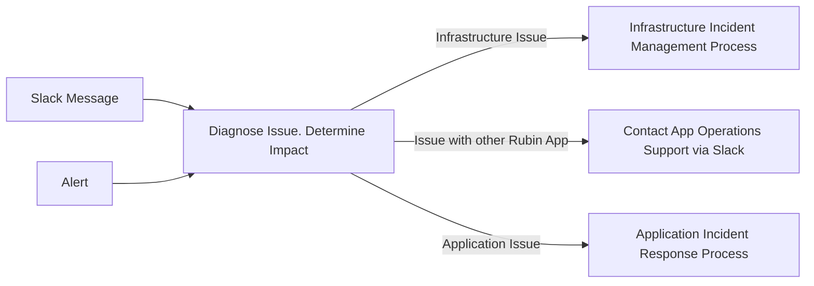
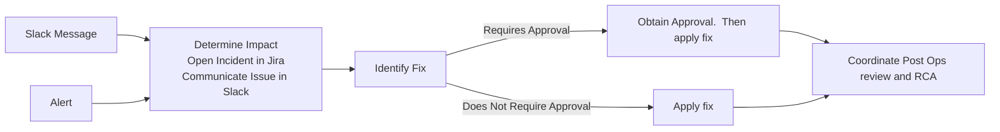
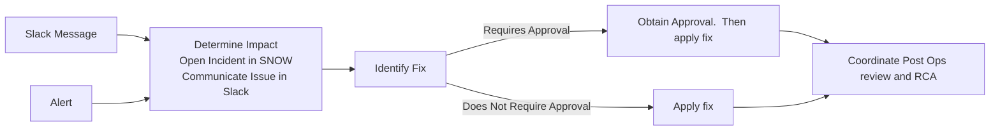

# USDF Rubin Application Operations Support Model

```{abstract}
Support model for Rubin applications in the US Data Facility.  This includes Rubin application team roles, incident management, problem management, service management, and release management.
```

## Problem Addressed

A structured operating model is critical for ensuring the availability, reliability, and security of the Rubin Applications. By implementing standardized processes, roles and communication, USDF will minimize downtime, and optimize resource utilization.

Specifically the Rubin Application Operations Support Model is intended to:
* Provide role clarity
* Standardize processes to streamline work
* Improve ability to respond to issues


## Support Responsibilities

SLAC is responsible for supporting the following systems:
* Kubernetes and vClusters
* Ingress
* Certificate Manager
* Servers
* Storage.  This includes Ceph and Weka
* Network
* DNS
* Authentication

Rubin is responsible for the supporting the following:
* Applications
* MariaDB and MySQL Databases
* SSL Certificates
* Cassandra

There is an overlap with the following.
* Postgres Databases

The following areas need to be resolved.
* Phalanx and ArgoCD

|      | Application Team | | | |                             | SLAC     |          |          |
| ---- | --------- | --------- | -------- | --- | ----------- | -------- | -------- | -------- |
| Task | Owner | Developer | App Infr | DBA | Ops Support | SLAC Ops | SLAC DBA | End User |
| ---- | ----- | --------- | -------- | --- | ----------- | -------- | ---------| ---------|
| App Deployment | A | R | R | R | R | I |  | | I |
| App Monitoring | | C | C | C | R/A | C | C |  |
| App Incident Management | C | C | C | C | A/R | C | C | I |
| App Incident Escalation | C |  |  |  | A/R |  |  |  |
| Database Schema Design | I | C | | R/A | | | C | |
| Database Capacity Management | I | C | | R/A | | | C | |
| Database Backup & Recovery | I | | | R/A| | | C | |


|      | Application Team | | | |                             | SLAC     |          |          |
| ---- | --------- | --------- | -------- | --- | ----------- | -------- | -------- | -------- |
| Task | Owner | Developer | App Infr | DBA | Ops Support | SLAC Ops | SLAC DBA | End User |
| ---- | ----- | --------- | -------- | --- | ----------- | -------- | ---------| ---------|
| Infrastructure Monitoring |  |  |  |  | I | R/A |  |  | 
| Infrastructure Incident Management  |  |  |  |  | I | R/A |  |  | 
| Incident escalation  |  |  |  |  | I | R/A |  |  | 


## Application Support Model

Below are details on the application support model for Rubin applications.  This model is used to define the roles, responsibilites, and priorities for support.

### Application Roles

Each Rubin application should have the following roles defined to manage and operate the application.  A person can have more than one role and may be condensed.  Below are the roles and responsibilities required for each role.

| Role | Responsibilities |
| ---- | ---------------- |
| Application Sponsor | Responsible for assigning resources |
| Application Owner | Responsible for the overall application functionality, data, and user experience |
| Database Administrator | Responsible the database’s design, performance, security, and maintenance.  Not required if there is no database |
| App Infrastructure | Responsible for the infrastructure configuration, deployment, and routine maintenance |
| Operations Support | Responsible for the support of the application.  Handles alerts, application monitoring, application incident response |

### SLAC and Rubin Team Infrastructure Roles

Below are the roles and responsibilities for the SLAC and Rubin Infrastructure teams.

| Role | Responsibilities |
| ---- | ---------------- |
| Infrastructure Services Support (Physical) | Responsible for physical datacenter, servers, storage, and networking.  This includes Weka and Ceph. |
| Applications and Users (Virtual) | Responsible for the virtual infrastructure, Kubernetes cluster, vClusters and Kubernetes Weka Storage.  The DBA is on this team and is responsible for Butler and providing subject matter expertise to help the App DBAs. |
| Astro Domain / Rubin Specific | Understanding Science Operations, Teams, and Roles.  They may also be application owners. |

### Application Tiering

Application tiering is needed to align the operations model to supporting key Rubin processes and capabilities.  This will be used as decision support for the following type of scenarios:
* When there are multiple issues occurring and the team is constrained on what they can work on.  Mission Critical applications will be prioritized over critical and operational tier applications.
* When there are hardware issues and there are limited resources to run everything
* During disaster recovery to prioritize which applications to restore

Below are the proposed application criticality levels.

| Tier | Definition | Impact of Failure | Examples |
| ---- | ---------- | ----------------- | -------- |
| Mission Critical | Most important application. Essential for success of Rubin | Required process will not run | Embargo Butler, Prompt Processing, PanDa, Sasquatch |
| Critical | Applications that are essential for day to day operations, but not as crucial as mission critical | Can cause significant delays, disruptions, or reduce productivity | ConsDB, Rubin Science Platform Nublado |
| Operational | Applications that support science functions, but are not considered essential for the immediate functioning of work | May cause disruptions, but not major ones |  Exposurelog, RubinTV, LFA |

The tiers for applications will be identified as part of the operations checklist activities.  The application tiering can change over time and will change for some applications after commissioning.

### Application Domains

There are over 50 Rubin applications installed at the USDF and the number is growing.  An approach is needed to organize applications to define high level ownership and reduce complexity.  The below application domains are proposed to organize Rubin Applications.

| Application Domain | Description | Example Applications | Owner |
| ------------------ | ----------- | -------------------- | ------|
| Alert Production | Responsible for creating and distributing alerts | Prompt Processing, Alert Stream Broker | Alert Production Team |
| Build Engineering | Building of the shared stack | Jenkins | Build Engineering |
| Data Release Production | Responsible for the processing and creation of data releases | PanDA, Rucio |
| Data Transfer | Respsnsible for the transfer of files from the Summit to USDF and Data Facilities | Embargo Ingest, Rucio | |
| Data Wrangling | Data management and abstration | Embargo Butler, Main Butler | |
| Rubin Science Platform at USDF | Portal Notebooks, Notebooks, and Image API services used at the USDF | |
| QA | Validation and Verification of Camera Options | Exposurelog, Consdb, Rubin TV | |

### Operations Checklist

A checklist is developed to review and validate that an application is ready for operations.  This checklist will be completed by each application team.   Below is a summary of what is included in the Operations Checklist.

* Application Support Model
  * Application roles, tier, production hours, and maintenance hours defined.
  * Review of staffing levels and sufficient staff to run and support application
  * Runbook completed.  This includes common operational procedures, infrastructure dependencies, and other Rubin application dependencies
  * Concerns of open issues remediated
* Release Management
  * Release management and application deployment process defined.  Dev and Production environments deployed.
  * Code in Rubin or SLAC GitHub.  Container images stored in LSST GitHub packages.
  * Upgrade process defined for any Kubernetes Operators in use
* Infrastructure
  * High availability configuration
  * IP Address allocated from `sdf-ingest` pool.  No hard coded IP addresses and use of DNS entries.
  * Unused configuration removed
  * Kubernetes Resource requests implemented
* Database 
 * Partioning implemented for databases that will grow larger than supported by Postgres
 * Retries enabled for database connections
 * Database backups are running
 * Postgres Poolers created and in use.  Idle timeout set for Pooler.
* Security
  * Any SLAC Cyber review and/or exceptions done
  * All secret in Vault.
  * Administrative access to the application using SLAC credentials
  * Embargo annotations and affinity rules deployed if applicable
  * Patch process defined to update application libraries in the the Runbook


## Monitoring and Alerting

The USDF Grafana is used for monitoring and alerts.  Prometheus is the main source of application and infrastructure metrics.  Loki is used to capture logs from applications.   Below are are the requirements and design for monitoring and alerting.

### Monitoring and Alerting Requirements

Below are the requirements for monitoring and alerting.

* Alerts will be created for application errors and performance metrics.  Ideally application issues should be identified proactively by alerts and not by end users.  This will take time to implement.  As new issues are reporting by end users part of the remediation process will be to create alerts when there is missing coverage.
* Application Alerts should be created in Grafana.  A Slack channel will be created for each application for these alerts.  Today all alerts goto `usdf-alerts`.    New Slack channels will be created for each application domain.  For example `usdf-alert-production-alerts`.  It is the responsibility of the Operations Support role in each team to monitor and respond to these alerts.
* Application logs volumes should be reviewed to ensure they are not filling up log storage.  Debug level logs should only be enabled to troubleshoot issues.
* Sensitive data such as passwords or secrets should not be logged.
* A red/yellow/green stoplight dashboard is required to provide an at a glance view of the health of USDF applications.  Tags for each application domain will be added to Grafana to faciliate the aggregation of alerts into this dashboard.
* Dashboads will be created for each application domain to provide a summary view of health, performance, and issues.
* Squadcast will be used to provide alert management and route alerts.   <- Is there licensing for this?

## Incident Management

Below details the proposed incident management process.  Current incident management processes uses Slack channels and a daily standup.  These recommendations are to enhance current processes.

Rubin uses the cloud version of Jira to manage requests, development, and project work.  Jira has Service Management template projects available for service management that include incident and problem management.  This will enable a consolidated view of incidents and tracking of response and resolution times. 

### Incident Impact

Below are the impact levels that will be used to prioritize incident response.  High/Medium/Low were selected because these levels are already configured in the SLAC Service Now and impact levels are not defined in Rubin Jira.

| Impact Level | Description   | Response Time | Resolution Targets |
| ------------ | ------------- | ------------- | ------------------ |
| High | Blocks production for Mission Critical application | ASAP during working hours | ASAP, requires working until fixed|
| Medium | Significant impact on operations; work can continue with limitations. | Rapid triage (within 4 hours) | May begin at start of next working day |
| Low | Minor functionality issues or performance degradation. | within 1 day | within 3 days |


### Incident Management Process

Below is the incident management process for incidents when it is unknown if it is an application or infrastructure issue.



Below is the incident management process for application issues.



Below is the incident management process for infrastructure issues.



### Reporting Incidents

Slack channels in the Rubin Observatory Slack instance are used to report incidents.  Below are the Slack channels, purpose of each, and who is responsible for monitoring the Slack channel.  Threads should be used to organize the discussion of individual issues.

| Slack Channel | Purpose | Slack User Group Handle |
| ------------- | ------- | -------------------------- |
| usdf-on-sky-support | Channel for issues, questions, and support requests for USDF related to LSSTCam on-sky commissioning.  Should be limited to issues that have an impact on decisions about commissioning activities at the summit on (roughly) 12- to 48-hour timescales | usdf-on-sky-help |
| usdf-support | USDF user support channel. Intended for issues by end users  | usdf-help |
| usdf-infra-support | USDF infrastructure support channel, i.e., intended for developers of USDF-hosted services to raise support issues related to USDF infrastructure | usdf-infra-help |
| usdf-rsp-support | USDF Rubin Science Platform support | usdf-rsp-help |

An on call rotation will be created to monitor the above Slack channels during daytime working hours.  Note that Slack channels will not be monitored during nightime when there is observing because SLAC is not staffed for this.

To avoid the same person being consistently asked to help even when they are not on call the Slack user group feature will be used to mention for assistance.  The user group handles are included in the above table.  How to setup Slack user groups is discussed [here](https://slack.com/help/articles/212906697-Create-a-user-group#:~:text=Create%20user%20groups%20to%20notify,notify%20everyone%20in%20the%20group.)

## Problem Management

Slack bot

## Change Management

The following types of changes will require approval before making changes.

| Change Type | Approver |
| ----------- | -------- |
| Embargo Storage | 

Cap like meeting.  Sign off.

Conflicting changes.

Visibility.


## Service Management

Service Owners and Process Owners.

### Maintenance Windows

Patch Thursday will be used to perform upgrades and patches.

## Release Management